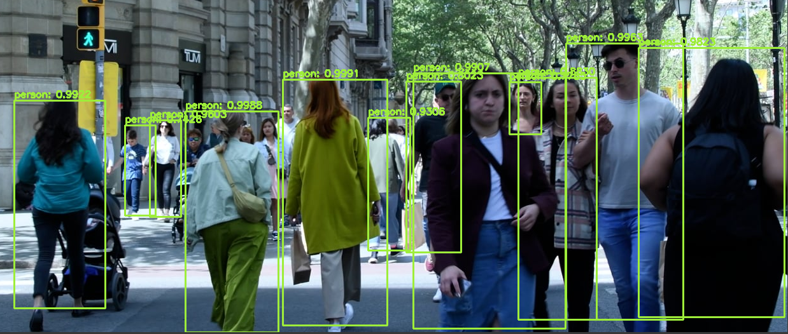
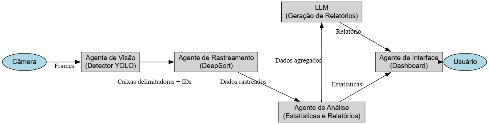
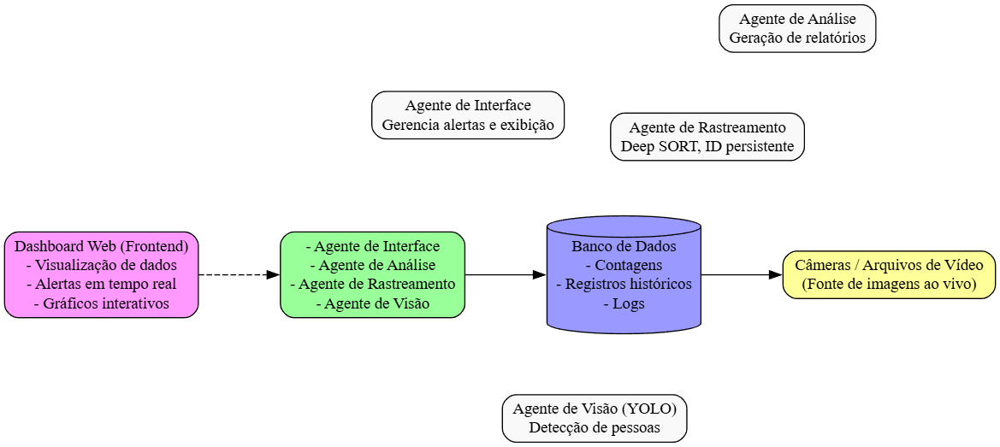

# Detecção e Contagem de Pessoas em Espaços Públicos com Geração automática de relatórios usando LLM.
## 👨‍🎓 Integrantes

<table>
  <tr>
    <td align="center">
      <a href="https://github.com/MatheusCarne" target="_blank">
         
        
          <b>Matheus Carneiro | 202111250033</b>
        
      </a>
    </td>
    <td align="center">
      <a href="https://github.com/LucasByteX" target="_blank">
         
        
          <b>Lucas Daris | 202021250037</b>
        
      </a>
    </td>
  </tr>
</table>

## 💡 Ideia Principal
Um sistema que analisa imagens para contar o número de pessoas e detectar padrões de movimentação e com isso gerar relatórios com agentes inteligentes.

  

## 🎯 Objetivos
- Geração de relatórios com agentes inteligentes
- Dashboard que exibe estatísticas em tempo real sobre a movimentação.  
- Integrar alertas para controle de lotação.  
- Talvez analisar tendências de fluxo.

## 👥 Público-Alvo
Empresas e governos que precisam monitorar o fluxo de pessoas em locais públicos para otimizar serviços e segurança.

## 🤖 Agentes Envolvidos
- **Agente de Visão (Detector)**: Responsável por detectar pessoas nas imagens captadas pelas câmeras usando visão computacional.  
- **Agente de Rastreamento (Tracker)**: Rastreia os indivíduos detectados para evitar contagens duplicadas e identificar padrões de movimentação.  
- **Agente de Análise (Analista)**: Compila os dados de rastreamento e gera estatísticas, insights e relatórios.  
- **Agente de Interface (Dashboard)**: Exibe em tempo real os dados coletados e gerencia os alertas para controle de lotação.  

## 🧱 Tecnologias Pretendidas
- **Linguagem de Programação:** Python  
  > Escolhida por ser amplamente usada em aplicações de visão computacional e possuir grande variedade de bibliotecas especializadas.

- **Bibliotecas e Frameworks:**
  - **YOLO / OpenCV + Haar Cascades**: Para detecção de pessoas.  
    > YOLO é rápido e eficiente para detecção em tempo real; Haar é uma alternativa mais leve para ambientes com menos poder computacional.
  - **DeepSort**: Para rastreamento de indivíduos.  
    > Permite identificar e seguir pessoas ao longo de múltiplos frames, evitando duplicações.
  - **OpenCV**: Para pré-processamento de imagens e manipulação de vídeo.  
  - **Flask ou FastAPI**: Para criar uma API e interface web com o dashboard.  
    > FastAPI tem melhor performance e é mais moderna; Flask é mais simples e direto.
  - **GPT-4 ou LLaMA**: Geração Automática de Relatórios.
    > Um LLM pode analisar os dados de movimentação (fluxo por horário, local, etc.) e gerar relatórios descritivos automaticamente.
    > Ex: “Hoje, entre 12h e 14h, observou-se um aumento de 35% no fluxo em relação à média da semana.”
  - **Banco de Dados (SQLite ou PostgreSQL)**: Armazenamento das contagens e histórico.  
    > SQLite é leve e fácil de configurar; PostgreSQL é robusto para produção e grandes volumes de dados.

      
- **Ferramentas de Visualização:**  
  - Bibliotecas de gráficos (como Plotly ou Matplotlib) para visualização no dashboard.  

## 📦 Entradas e Saídas Esperadas
**Entradas:**
- Vídeos ou imagens de câmeras em tempo real.
- Parâmetros de configuração (como zonas de interesse ou limite de lotação).

**Saídas:**
- Contagem de pessoas em tempo real.
- Alertas de lotação (por exemplo, se ultrapassar determinado número).
- Relatórios e gráficos sobre fluxo de pessoas ao longo do tempo.
- Logs históricos com dados por dia/horário/local.

## 🔁 Interação entre os Agentes
- O **Agente de Visão** processa os frames das câmeras e envia as detecções para o **Agente de Rastreamento**.
- O **Agente de Rastreamento** mantém o histórico de cada pessoa detectada e envia dados para o **Agente de Análise**.
- O **Agente de Análise** gera estatísticas, identifica horários de pico e detecta padrões.
- O **Agente de Interface** consome essas informações para exibir no dashboard e emitir alertas em tempo real.

  

## 📌 Status Inicial do Projeto
- [x] Ideia discutida e validada com o professor  
- [x] Estrutura básica do repositório criada  
- [x] Quadro no GitHub Projects criado  
- [x] Primeiras tarefas definidas e atribuídas  

## 📄 Documentação Futura
Este repositório poderá incluir:
- Relatórios parciais de progresso  
- Scripts de testes ou simulações  
- Resultados e conclusões finais  
- Diagramas de arquitetura do sistema multiagente

  

